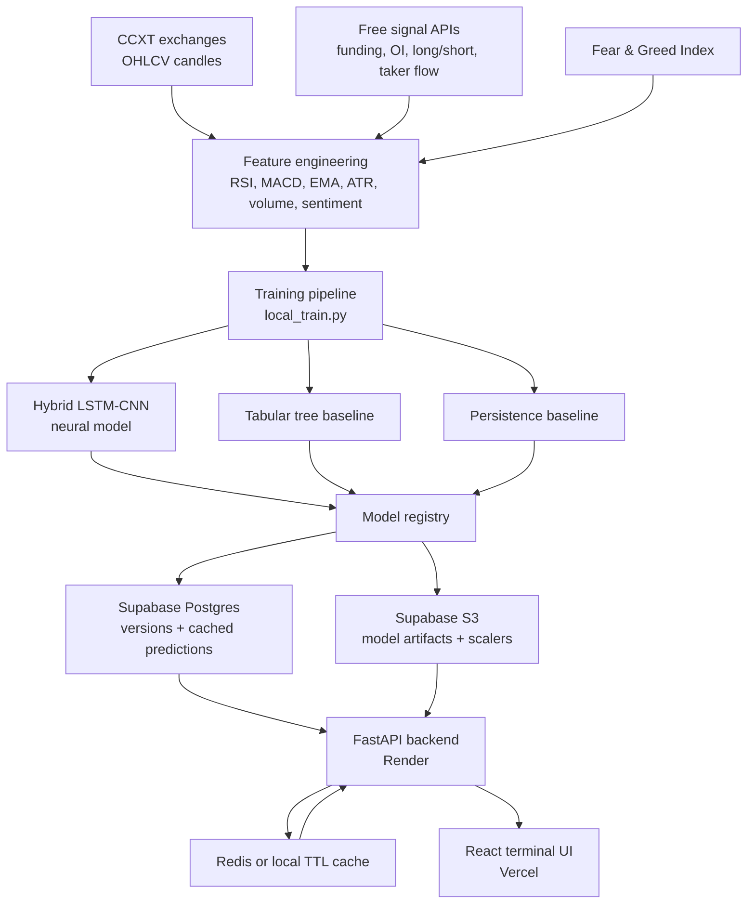

<div align="center">


# CryptoQuant

**Quantitative Analytics Terminal for Crypto Forecasting**

A full-stack ML forecasting dashboard powered by a weighted Neural + Tree + Persistence ensemble, Monte Carlo Dropout uncertainty bands, free market-structure signals, and a production cache designed for a Vercel frontend and Render backend.

[](https://github.com/AaravKashyap12/CryptoQuant/stargazers)
[](https://react.dev)
[](https://fastapi.tiangolo.com)
[](https://tensorflow.org)

[Live Demo](https://cryptoquant.vercel.app) · [Report Bug](https://github.com/AaravKashyap12/CryptoQuant/issues)

</div>

---

## What It Does

CryptoQuant turns exchange market data into short-range crypto forecasts with a transparent model breakdown. It is built as an ML engineering showcase: real training pipeline, model registry, cached inference, live market data, uncertainty intervals, and a production-style frontend.

| Capability | Details |
|---|---|
| **1-day ensemble forecast** | Combines neural, tree, and persistence components with explicit serving metadata. |
| **Hybrid neural leg** | LSTM + CNN architecture with attention-style sequence learning and MC Dropout uncertainty. |
| **Tabular baseline** | Tree model trained from the same engineered sequence window for robust small-data performance. |
| **Persistence anchor** | Keeps predictions close to recent market reality when model signal quality is weak. |
| **Uncertainty bands** | 50 Monte Carlo passes used for neural uncertainty and ensemble confidence intervals. |
| **Free market signals** | Binance public futures context: funding rate, open interest, long/short ratio, and taker buy/sell flow. |
| **Lazy validation** | 30-day walk-forward backtest runs only when requested, then caches results. |
| **Live prices** | Binance WebSocket ticker stream for real-time price and 24h change. |
| **Prediction cache** | Redis -> database store -> live inference fallback. |

---

## Architecture



---

## Model Pipeline

The training path is chronological and leak-aware:

1. Fetches OHLCV data from multiple exchanges.
2. Adds technical, sentiment, volume, and market-context features.
3. Builds sequence windows for the neural model and tabular snapshots for the baseline.
4. Splits train / validation / test chronologically.
5. Fits scalers only on training data.
6. Trains the neural and tabular legs.
7. Evaluates MAE, RMSE, and directional accuracy.
8. Registers the model only if it is eligible for cached serving.

The served response includes metadata such as `serving_mode`, `mc_iterations`, model version, and cached-serving eligibility so the frontend can explain what users are seeing.

---

## Tech Stack

| Layer | Stack |
|---|---|
| **Frontend** | React 19, Vite, Recharts, Framer Motion, lucide-react |
| **Backend** | FastAPI, Uvicorn, SQLAlchemy, Pydantic Settings |
| **ML** | TensorFlow CPU, scikit-learn, XGBoost, pandas, NumPy |
| **Data** | CCXT, alternative.me, Binance public market endpoints |
| **Storage** | Supabase Postgres, Supabase S3-compatible storage |
| **Cache** | Redis in production, in-process TTL fallback locally |
| **Deployment** | Vercel frontend, Render backend, GitHub Actions training workflow |

---

## Project Structure

```text
CryptoQuant/
  local_train.py                 training + prediction precompute pipeline
  render.yaml                    Render backend blueprint
  requirements.txt               root Python requirements pointer

  services/api/
    main.py                      FastAPI app and model prewarm
    routes/endpoints.py          public, admin, validation, and debug routes

  shared/
    core/config.py               app settings and env flags
    ml/
      models.py                  neural model builders
      tabular.py                 tree baseline
      training.py                train/evaluate/register pipeline
      predict.py                 inference, MC Dropout, ensemble blend
      registry.py                model registry and cached predictions
      storage.py                 local/S3 storage strategy
    utils/
      data_fetcher.py            OHLCV, sentiment, market context
      features.py                technical feature engineering
      onchain_fetcher.py         free market signal provider
      preprocess.py              train/inference preprocessing

  frontend/
    src/
      App.jsx                    dashboard shell
      components/                charts, metrics, explainer, signal panels
      hooks/useLivePrice.js      Binance WebSocket live price hook
      lib/api.js                 API client

  tests/unit/                    regression and preprocessing tests
```

---

## Local Preview

```bash
# backend
python -m venv venv
venv\Scripts\activate
pip install -r requirements.txt
python -m uvicorn services.api.main:app --host 127.0.0.1 --port 8002

# frontend
cd frontend
npm install
npm run dev
```

The frontend uses the Vite proxy in local development, so it can call `/api/v1/*` without hardcoding the backend URL.

---

## Disclaimer

CryptoQuant is an educational ML engineering project. It is not financial advice, and its forecasts should not be used as the sole basis for trading decisions.

<div align="center">

Built by [Aarav Kashyap](https://x.com/KashyapAarav_)

</div>
