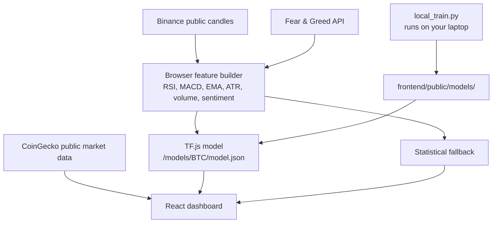

<div align="center">


# CryptoQuant

**Frontend-only crypto forecasting dashboard**

CryptoQuant is now a pure Vite + React + TF.js app. It uses free public market APIs in the browser and loads locally trained models from `frontend/public/models`.

[](https://react.dev)
[](https://vite.dev)
[](https://www.tensorflow.org/js)

</div>

---

## What It Does

| Capability | Details |
|---|---|
| **Market data** | Daily OHLCV candles come from Binance public REST APIs. |
| **Live price** | Binance WebSocket ticker stream powers the live price tile. |
| **Sentiment** | Fear & Greed Index comes from alternative.me. |
| **Market signals** | CoinGecko public market data provides free volume, market-cap, and price-change proxies. |
| **Prediction** | The frontend tries `/models/<COIN>/model.json` with TF.js. If no model exists, it falls back to a statistical volatility baseline. |
| **Validation** | The 30-day backtest is computed in-browser from recent candle windows. |

No FastAPI server, Render service, Redis cache, database registry, or GitHub Actions retraining job is required.

---

## Architecture



---

## Local Preview

```bash
cd frontend
npm install
npm run dev
```

Open the Vite URL shown in the terminal, usually `http://localhost:3000`.

You can also run `run_dev.bat` on Windows; it starts only the frontend.

---

## Local Training

Install the laptop training dependencies once:

```bash
python -m venv venv
venv\Scripts\activate
pip install -r requirements.local.txt
```

Train and export browser models:

```bash
python local_train.py
```

The trainer writes:

```text
frontend/public/models/BTC/model.json
frontend/public/models/ETH/model.json
frontend/public/models/BNB/model.json
frontend/public/models/SOL/model.json
frontend/public/models/ADA/model.json
```

If a model is missing or TF.js export fails, the dashboard still works using the browser statistical baseline.

For the daily production refresh workflow, run:

```bat
train_and_push.bat
```

That script trains locally, stages `frontend/public/models`, commits changed model files, and pushes to GitHub. Vercel will redeploy from that push and serve the fresh static model files. Use `train_models.bat` when you want to train locally without pushing.

---

## Project Structure

```text
CryptoQuant/
  local_train.py                 standalone laptop trainer
  requirements.local.txt         local training dependencies only
  run_dev.bat                    starts Vite frontend
  train_models.bat               Windows model training launcher
  train_and_push.bat             trains, commits model files, pushes
  train_models.sh                macOS/Linux model training launcher

  frontend/
    public/models/               TF.js model exports for Vercel/static hosting
    src/
      App.jsx                    dashboard shell
      components/                charts, metrics, explainer, signal panels
      hooks/useLivePrice.js      Binance WebSocket live price hook
      lib/api.js                 browser-only public data layer
      lib/inference.js           TF.js model loading and feature builder
```

---

## Push Checklist

```bash
cd frontend
npm run lint
npm run build
cd ..
cmd /c node --test frontend/src/lib/api.test.js frontend/src/lib/inference.test.js
git status
git add .
git commit -m "Convert CryptoQuant to frontend-only app"
git push origin main
```

After this frontend-only version is live, the old Render backend can be suspended or deleted. The app no longer uses `VITE_API_URL`, FastAPI, Redis, Supabase, or any backend route.

---

## Disclaimer

CryptoQuant is an educational ML project. It is not financial advice, and its forecasts should not be used as the sole basis for trading decisions.

<div align="center">

Built by [Aarav Kashyap](https://x.com/KashyapAarav_)

</div>

---

### Portfolio

See more of my work at [https://www.aaravkashyap.live/](https://www.aaravkashyap.live/).
